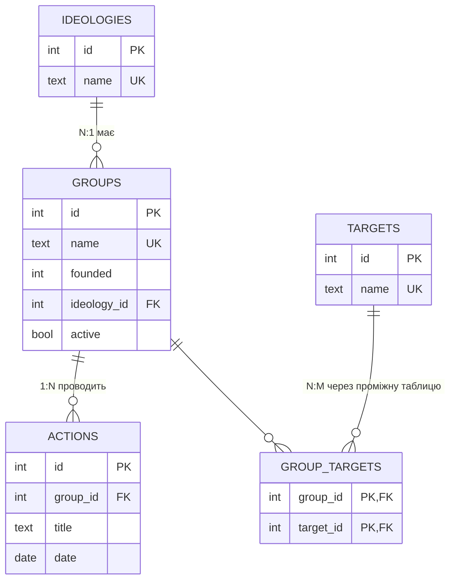

# ERD

```mermaid
erDiagram
    IDEOLOGIES ||--o{ GROUPS : "N:1 має"
    GROUPS ||--o{ ACTIONS : "1:N проводить"
    GROUPS ||--o{ GROUP_TARGETS : ""
    TARGETS ||--o{ GROUP_TARGETS : "N:M через проміжну таблицю"

    IDEOLOGIES {
        int id PK
        text name UK
    }
    GROUPS {
        int id PK
        text name UK
        int founded
        int ideology_id FK
        bool active
    }
    ACTIONS {
        int id PK
        int group_id FK
        text title
        date date
    }
    TARGETS {
        int id PK
        text name UK
    }
    GROUP_TARGETS {
        int group_id PK,FK
        int target_id PK,FK
    }
```
